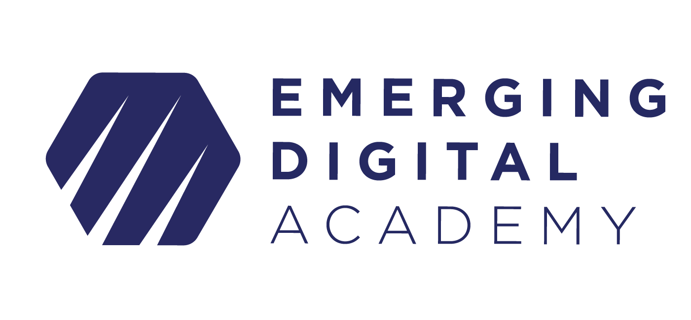

# Pygame Workshop

<!-- ## [Workshop Video](https://vimeo.com/771394146/cc7597882b) -->

## Welcome!

Hello, and welcome to the Emerging Digital Academy: Pygame Workshop. Today we
will be going over the basics of creating a "Hello World" project using Pygame!

## Requirements

As this is an intro workshop, there are not many requirements except:

- A working installation of Python3 on your machine
    - [Python Download Link](https://www.python.org/downloads/)
- The VS Code text editor installed
    - [VSCode Download Link](https://code.visualstudio.com/download)
- An eagerness to learn

## Agenda

The content we will be going over will include:

- What is Pygame?
- What is a class?
- Building a `Hello World` Application
    - Initializing Pygame
    - Loading an item and moving an item
    - Moving an item with mouse input
    - Moving an item with keyboard input

## Resources

Different resources that will be helpful throughout the workshop:

- [W3 Schools](https://www.w3schools.com/python/default.asp)
- [Python3 Documentation](https://docs.python.org/3/)
- [Pygame Documentation](https://www.pygame.org/docs/)
- [FreeCodeCamp Pygame Tutorial](https://www.youtube.com/watch?v=FfWpgLFMI7w)

<!-- 
## Application Preview

-->